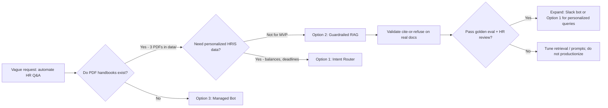

# HR Policy Automation — Guardrailed Knowledge RAG

> **Branch:** `prototype/guardrailed-knowledge-rag`  
> **Status:** Working MVP — web UI + CLI with cite-or-refuse guardrails  
> **Proposal:** [plan.md](./plan.md) · **Technical spec:** [spec.md](./spec.md)

A document-centric Retrieval-Augmented Generation (RAG) system that answers repetitive HR policy questions from verified PDF handbooks — with strict **cite-or-refuse** behavior to prevent hallucinated policy answers.

---

## Table of Contents

1. [Overview](#overview)
2. [Architecture](#architecture)
3. [Quick Start](#quick-start)
4. [Usage](#usage)
5. [Web UI](#web-ui)
6. [Configuration](#configuration)
7. [Response Format](#response-format)
8. [Project Structure](#project-structure)
9. [Guardrail Model](#guardrail-model)
10. [Evaluation](#evaluation)
11. [Design Decisions](#design-decisions)
12. [Why Option 2 Was Built First](#why-option-2-was-built-first)
13. [Scope Boundaries](#scope-boundaries)
14. [Future Work](#future-work)
15. [Troubleshooting](#troubleshooting)

---

## Overview

### Problem

HR teams spend hours each week answering the same policy questions from new hires — vacation accrual, expense rules, benefits deadlines. The stakeholder request was vague: *"Can we automate this somehow?"*

The real need is **safe question deflection** — not a chatbot that sounds helpful but invents policy.

### Solution

This prototype (Option 2 from the proposal) ingests HR PDF handbooks, retrieves relevant passages via semantic search, and generates answers **only** from retrieved context. When context is insufficient, it refuses and directs the employee to HR.

### When to use this approach

| Good fit | Poor fit |
| :--- | :--- |
| Static policy text in existing PDFs | Personalized data ("my PTO balance") |
| Privacy-sensitive document handling | Need Slack bot live in 1 week |
| Compliance risk on wrong answers | Policies scattered / undocumented |

---

## Architecture

```
┌─────────────────────────────────────────────────────────────────┐
│                     OFFLINE — Ingestion                         │
│  data/*.pdf  →  documents  →  chunker  →  embeddings  →  store │
└─────────────────────────────────────────────────────────────────┘
                                    │
                                    ▼
                           data/chroma/ (ChromaDB)
                                    │
┌─────────────────────────────────────────────────────────────────┐
│                      ONLINE — Query                             │
│  question  →  embed  →  retrieve top-K  →  LLM  →  response   │
│                     ↑ guardrails at 3 layers ↑                  │
└─────────────────────────────────────────────────────────────────┘
```

| Layer | Module | Responsibility |
| :--- | :--- | :--- |
| Load | `documents.py` | Extract text from PDF pages |
| Chunk | `chunker.py` | Token-based segmentation with overlap |
| Embed | `embeddings.py` | OpenAI vectorization |
| Store | `store.py` | ChromaDB persistent vector index |
| Generate | `llm.py` | OpenAI primary → Groq fallback |
| Guard | `prompts.py`, `query.py` | Cite-or-refuse contract |

---

## Quick Start

### Prerequisites

| Requirement | Notes |
| :--- | :--- |
| [uv](https://docs.astral.sh/uv/) | Package manager; install via `pip install uv` |
| Python 3.12 | Downloaded automatically by uv |
| OpenAI API key | Required for embeddings and primary LLM |
| Groq API key | Recommended fallback for LLM generation |

### Install

```powershell
git clone https://github.com/Galina-Blokh/hr-policy-automation-proposal.git
cd hr-policy-automation-proposal
git checkout prototype/guardrailed-knowledge-rag

python -m uv venv .venv --python 3.12
python -m uv pip install -e . --python .venv\Scripts\python.exe

copy .env.example .env
# Edit .env with your OPENAI_API_KEY and GROQ_API_KEY
```

### First run

```powershell
# 1. Ingest PDFs from data/
.venv\Scripts\python.exe -m src.ingest --source data

# 2. Ask a question (web UI — recommended)
.venv\Scripts\hr-ui

# Or CLI:
.venv\Scripts\python.exe -m src.query "What is the company policy on remote work?" --pretty

# 3. Run evaluation
.venv\Scripts\python.exe -m src.eval
```

---

## Usage

### Ingest documents

```powershell
.venv\Scripts\python.exe -m src.ingest --source data
```

| Flag | Description |
| :--- | :--- |
| `--source PATH` | PDF file or directory (default: `DATA_DIR`) |
| `--no-reset` | Append to existing store instead of replacing |

**Current corpus:** 3 PDFs → 144 pages → 187 chunks.

### Query

```powershell
.venv\Scripts\python.exe -m src.query "When does vacation accrual start?" --pretty
```

| Flag | Description |
| :--- | :--- |
| `--pretty` | Human-readable indented JSON output |

### Evaluate

```powershell
.venv\Scripts\python.exe -m src.eval
.venv\Scripts\python.exe -m src.eval --file tests/golden_qa.json
```

---

## Web UI

Launch the Streamlit chat interface:

```powershell
.venv\Scripts\hr-ui
# or
.venv\Scripts\python.exe -m streamlit run src/ui.py
```

Opens at **http://localhost:8501** by default.

| Feature | Description |
| :--- | :--- |
| **Input at top** | Question form stays above all conversation history on every rerun |
| Conversation history | Previous Q&A rendered below the input area |
| Citations | Expandable source list with document, page, and chunk ID |
| Refusal display | Clear warning when policy cannot be verified |
| Example questions | One-click buttons under the input for demo scenarios |
| Sidebar | Indexed chunk count, clear chat, HR contact email |

---

## Configuration

All settings are loaded from `.env`. See [.env.example](./.env.example) for the full list.

| Variable | Default | Purpose |
| :--- | :--- | :--- |
| `OPENAI_API_KEY` | — | Embeddings + primary LLM (**required**) |
| `GROQ_API_KEY` | — | Fallback LLM when OpenAI fails |
| `REFUSAL_THRESHOLD` | `0.40` | Min similarity score to attempt an answer |
| `TOP_K` | `5` | Chunks retrieved per query |
| `CHUNK_SIZE` | `500` | Tokens per chunk during ingestion |
| `HR_CONTACT_EMAIL` | `hr@company.com` | Shown in refusal messages |

---

## Response Format

Every query returns JSON with the following schema:

```json
{
  "question": "string",
  "status": "answered | refused",
  "answer": "string",
  "citations": [
    {
      "doc_id": "string",
      "title": "string",
      "section": "string",
      "chunk_id": "string",
      "page_number": 23
    }
  ],
  "retrieval_score": 0.635,
  "provider": "openai | groq | null",
  "reason": "personalized_question | low_retrieval_score | model_refusal | null"
}
```

| `reason` value | Meaning |
| :--- | :--- |
| `personalized_question` | Blocked before retrieval (Layer 1) |
| `low_retrieval_score` | No sufficiently similar chunks (Layer 2) |
| `model_refusal` | LLM determined context was insufficient (Layer 3) |
| `null` | Question was answered successfully |

---

## Project Structure

```
censor-app/
├── plan.md                 # Full proposal (3 strategic options)
├── spec.md                 # Technical specification
├── README.md               # This file
├── pyproject.toml          # uv / Python 3.12 dependencies
├── .env.example            # Environment template (never commit .env)
├── data/
│   ├── *.pdf               # Source HR policy documents
│   └── chroma/             # Generated vector store (gitignored)
├── src/
│   ├── config.py           # Settings from environment
│   ├── documents.py        # PDF loading
│   ├── chunker.py          # Token-based chunking
│   ├── embeddings.py       # OpenAI embeddings
│   ├── store.py            # ChromaDB wrapper
│   ├── llm.py              # OpenAI → Groq fallback
│   ├── prompts.py          # Guardrail prompt templates
│   ├── ingest.py           # Offline ingestion CLI
│   ├── query.py            # Online query CLI
│   ├── ui.py               # Streamlit web UI
│   └── eval.py             # Golden Q&A evaluation
└── tests/
    ├── golden_qa.json       # Eval set for answer/refusal behavior
    └── README.md            # Eval set format and interpretation
```

---

## Guardrail Model

Three independent layers prevent unsafe answers:

| Layer | Where | Trigger | Action |
| :--- | :--- | :--- | :--- |
| **1. Pre-filter** | `query.py` | Personalized question patterns | Refuse immediately |
| **2. Retrieval gate** | `query.py` | Similarity < `REFUSAL_THRESHOLD` | Refuse without LLM call |
| **3. LLM contract** | `prompts.py` | Context insufficient | Model returns refusal text |

Refusal message (configurable via `HR_CONTACT_EMAIL`):

```
I cannot verify this from the current HR policy documents.
Please contact hr@company.com for assistance.
```

---

## Evaluation

Golden Q&A set at `tests/golden_qa.json` validates:

- Policy questions receive **answered** responses with citations
- Personalized / out-of-scope questions receive **refused** responses
- No fabricated policy text on refusal cases

**Current MVP result:** 6/8 passed (75%) on the starter eval set.

---

## Design Decisions

This section documents **why** specific choices were made — not just what was built.

### Why Option 2 (Guardrailed RAG) for this prototype?

See [Why Option 2 Was Built First](#why-option-2-was-built-first) for the full stakeholder decision logic. In short: PDF handbooks already exist, questions are mostly static policy text, and cite-or-refuse guardrails address compliance risk without requiring HRIS access on day one.

### Why a 3-layer guardrail instead of prompt-only?

| Approach | Risk | Our choice |
| :--- | :--- | :--- |
| Prompt-only ("don't hallucinate") | Model still guesses when retrieval fails | **Rejected** — insufficient for HR compliance |
| RAG without refusal threshold | LLM called even when no relevant chunk exists | **Rejected** — wastes tokens and increases hallucination |
| **3-layer: pre-filter + retrieval gate + prompt** | Defense in depth | **Chosen** — each layer catches failures the previous missed |

**Layer 1** blocks personalized questions (`"my PTO balance"`) before any API call — static PDFs cannot answer these.  
**Layer 2** refuses when cosine similarity < `REFUSAL_THRESHOLD` (0.40) — no LLM call when retrieval is weak.  
**Layer 3** prompt contract forces cite-or-refuse behavior when the LLM is invoked.

### Why `REFUSAL_THRESHOLD = 0.40`?

| Threshold | Effect |
| :--- | :--- |
| Too low (e.g. 0.25) | More answers, but higher risk of irrelevant context reaching the LLM |
| Too high (e.g. 0.60) | Safer refusals, but legitimate policy questions get blocked |
| **0.40 (chosen)** | Balanced for a 187-chunk corpus — tuned empirically against the golden Q&A set |

Adjust via `.env` after running `python -m src.eval` on your own handbook.

### Why 500-token chunks with 50-token overlap?

| Parameter | Rationale |
| :--- | :--- |
| **500 tokens** | Fits most policy paragraphs; small enough for precise retrieval |
| **50 overlap** | Prevents sentences split across chunk boundaries from being lost |
| Page-level metadata | Citations reference `{title} — page N` even when PDFs lack section headings |

### Why ChromaDB over pgvector?

| Criterion | ChromaDB | pgvector |
| :--- | :--- | :--- |
| MVP setup | Minutes, zero infra | Requires PostgreSQL instance |
| Corpus size (187 chunks) | More than sufficient | Over-engineered for prototype |
| Migration path | Swap `src/store.py` only | Same interface possible |

See [spec.md §14](./spec.md#14-vector-store-decision) for the full comparison.

### Why OpenAI + Groq (not a single provider)?

| Capability | Provider | Decision |
| :--- | :--- | :--- |
| Embeddings | **OpenAI only** | Groq has no embedding API; embeddings are required for retrieval |
| Generation | **OpenAI → Groq fallback** | Primary quality from `gpt-4o-mini`; Groq (`llama-3.3-70b`) keeps demos running if OpenAI fails |

### Why Streamlit (not React / FastAPI-only)?

| Option | Pros | Cons | Decision |
| :--- | :--- | :--- | :--- |
| CLI only | Fastest to build | Poor HR demo experience | Supplemented, not replaced |
| **Streamlit** | Chat UI in ~200 lines; same Python pipeline | Not production-grade UX | **Chosen for MVP demo** |
| Custom React | Full UX control | Days of frontend work unrelated to guardrail validation | Deferred |
| Slack bot | Best adoption | Requires platform setup + approval | Future work |

**UI layout decision:** Input form is pinned **above** conversation history (not bottom-fixed `st.chat_input`) so it remains visible after multiple example-question clicks — a Streamlit widget lifecycle requirement.

### Why build (not buy) for Option 2?

| Build (this prototype) | Buy (Copilot Studio / AWS Q) |
| :--- | :--- |
| Full control over cite-or-refuse behavior | Vendor guardrails vary; harder to audit |
| Documents stay in local ChromaDB | Data residency depends on vendor tier |
| 2–4 week custom MVP | 1–2 week config-only deploy |

**Decision:** Custom build fits privacy-sensitive HR docs and proves the guardrail pattern. Option 3 (managed bot) remains the right choice if discovery reveals Slack-first culture + limited engineering bandwidth.

---

## Why Option 2 Was Built First

This branch implements **Option 2** from [plan.md](./plan.md). The decision to prototype RAG before Options 1 or 3 follows the discovery framework:



| Discovery signal (this project) | Answer | Implication |
| :--- | :--- | :--- |
| Source documents exist? | 3 PDF handbooks in `data/` | RAG-ready |
| Personalized query mix? | Blocked by Layer 1 pre-filter | Option 1 needed later for HRIS queries |
| Compliance sensitivity? | High — refuse rather than guess | 3-layer guardrails required |
| Engineering bandwidth? | Sufficient for Python MVP | Custom build viable |
| Timeline? | Prototype for evaluation | Option 2 before Option 3 |

**What this prototype proves:** HR can deflect static policy questions from real PDFs with citations and without fabricated answers.  
**What it does not prove:** Personalized HRIS queries, Slack adoption, or production-scale ops.

---

## Scope Boundaries

Deliberately **not** included in this MVP:

| Excluded | Reason |
| :--- | :--- |
| Multi-turn conversation memory | Single-turn Q&A sufficient for policy lookups |
| HRIS write-back | Read-only Q&A; no Workday/ADP mutations |
| Production auth / SSO | Local prototype only |
| Slack/Teams integration | Web UI proves value; chat-platform deploy is v2 |
| Production auth / SSO | Local prototype only; no login gate |

---

## Future Work

Prioritized by impact and dependency on HR discovery answers:

| Priority | Item | Depends on | Effort |
| :--- | :--- | :--- | :--- |
| **P0** | Expand golden Q&A set from real HR question logs | HR provides anonymized sample week | 0.5 day |
| **P0** | Tune `REFUSAL_THRESHOLD` / `TOP_K` to reach ≥90% eval pass rate | Eval results | 0.5 day |
| **P1** | Slack or Teams bot wrapping `answer_question()` | Discovery Q1 (channel) | 1–2 weeks |
| **P1** | Automated re-ingestion when HR uploads new PDF | HR doc ownership process | 1 day |
| **P1** | Document effective-date metadata on chunks | Policy version tracking | 1 day |
| **P2** | **Option 1 branch** — intent router for personalized HRIS queries | Workday/ADP API access | 2–4 weeks |
| **P2** | Migrate `store.py` to pgvector | Existing PostgreSQL in client stack | 1 week |
| **P2** | Hybrid retrieval (vector + keyword/BM25) | Retrieval miss analysis | 2–3 days |
| **P3** | FastAPI REST wrapper for non-Streamlit clients | API consumers identified | 2–3 days |
| **P3** | Human review queue for low-confidence answers | HR ops workflow | 1 week |
| **P3** | Evaluate **Option 3** (Copilot Studio / AWS Q) for comparison | M365/AWS shop, fast deploy need | 1 week |

### Decision gates before production

1. **Accuracy gate** — Golden Q&A ≥ 90%; zero hallucinated policy on human audit sample.
2. **HR sign-off gate** — HR reviews 20 real answers and confirms citation quality.
3. **Channel gate** — Discovery Q1 determines Slack bot vs. web portal vs. both.
4. **Personalization gate** — If >30% of questions need HRIS data, implement Option 1 alongside Option 2.

---

## Troubleshooting

| Issue | Solution |
| :--- | :--- |
| `Vector store is empty` | Run `python -m src.ingest --source data` first |
| `OPENAI_API_KEY is required` | Add key to `.env` and restart |
| All queries refused | Lower `REFUSAL_THRESHOLD` (e.g. `0.35`); re-ingest |
| OpenAI fails but Groq works | Check logs; Groq fallback activates automatically |
| Poor answer quality | Increase `TOP_K`; verify PDF text extraction quality |

---

## Branches

| Branch | Description |
| :--- | :--- |
| `main` | Proposal document only |
| **`prototype/guardrailed-knowledge-rag`** | This RAG prototype |
| `prototype/intent-driven-agentic-router` | Option 1 — intent router + HRIS |

---

## License & Context

Internal evaluation prototype for the HR policy automation exercise. See [plan.md](./plan.md) for the full stakeholder proposal and decision framework.
