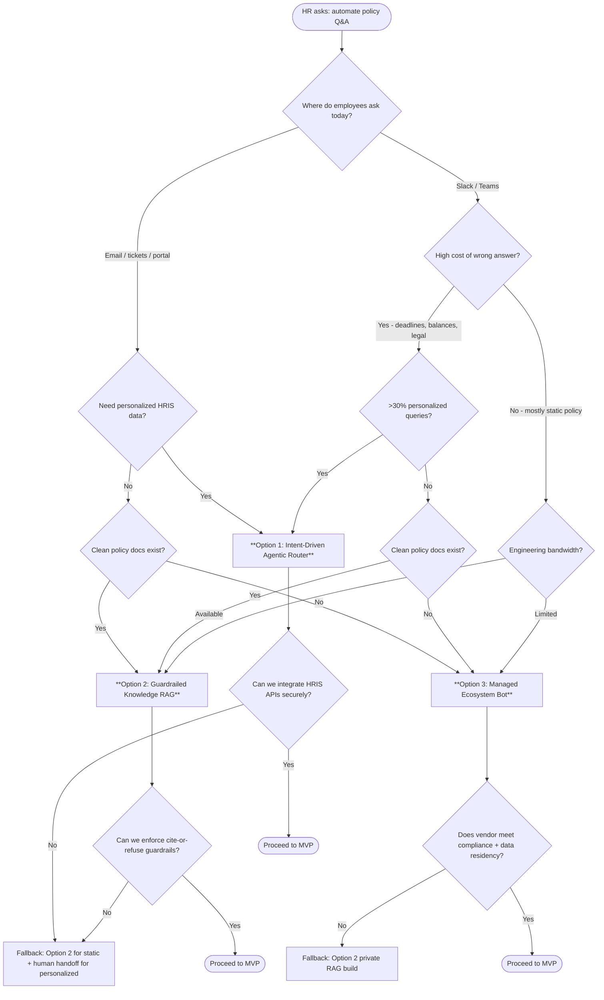

# Project Proposal: HR Policy Automation

**Prepared for:** HR Stakeholders & Engineering Leadership  
**Author:** AI/ML Engineer  
**Objective:** Turn a vague "automate HR policy questions" request into a scoped, low-risk path — with a clear decision framework for choosing among three viable approaches.

---

## 1. The Problem (As Stated)

The HR team spends hours each week answering repetitive policy questions from new hires — vacation accrual, expense rules, benefits enrollment deadlines. The stakeholder wants automation; what they actually need is **reliable question deflection without compliance risk** (e.g., an LLM inventing an expense policy or misstating a benefits deadline).

This proposal does not assume a solution yet. It defines **what we must learn first**, **three candidate paths**, and **how answers map to a recommendation**.

---

## 2. Discovery: 10 Questions That Drive the Decision

These questions are ordered by decision weight. The first three are non-negotiable for any path; the rest determine which option fits.

| # | Question | What It Tells Us | Strong Signal For |
| :--- | :--- | :--- | :--- |
| 1 | **Where do these questions currently happen?** *(Slack, Teams, email, ticketing?)* | Deployment surface and adoption path | **Option 3** if already in Slack/Teams; **Option 1/2** if email/tickets dominate |
| 2 | **What is the cost of a wrong answer?** *(Legal/financial vs. minor inconvenience)* | Tolerance for probabilistic answers | **Option 1** if high-stakes (balances, deadlines); **Option 2** if mostly static policy text |
| 3 | **How often do policies change, and who owns the source documents?** | Maintenance model | **Option 2/3** if HR owns PDFs and updates are infrequent; **Option 1** if mixed static + live HRIS data |
| 4 | **What % of questions need personalized data vs. static policy text?** *(e.g., "my PTO balance" vs. "pet insurance policy")* | Need for deterministic integrations | **Option 1** if >30% personalized; **Option 2/3** if mostly static |
| 5 | **Weekly inquiry volume and target deflection rate?** | ROI and complexity justification | High volume → justify **Option 1**; low volume → **Option 3** |
| 6 | **State of documentation?** *(Consolidated PDFs/Markdown vs. scattered intranet/tribal knowledge)* | RAG readiness | **Option 2/3** if docs exist; **Option 1** if data lives in HRIS APIs |
| 7 | **Data privacy and compliance boundaries?** *(GDPR, SOC2, HIPAA, data residency)* | Build vs. buy and hosting | Strict perimeter → **Option 2** (private build) or vetted **Option 3** enterprise tier |
| 8 | **Existing tech stack and IdP?** *(Okta, Azure AD, Workday, etc.)* | Integration feasibility | M365/Azure shop → **Option 3** (Copilot); Workday-heavy → **Option 1** |
| 9 | **Long-term engineering bandwidth?** | Operational burden tolerance | Limited bandwidth → **Option 3**; dedicated team → **Option 1/2** |
| 10 | **Target timeline and budget?** *(Weeks vs. months)* | Speed vs. customization tradeoff | <4 weeks → **Option 3**; 2–3 months → **Option 1/2** |

**Minimum viable discovery:** If we can only ask three questions before a decision, ask **#1, #2, and #4**. They separate "chatbot in Slack for dress code" from "compliance-sensitive router tied to Workday."

---

## 3. Decision Flow: Which Option to Pursue?

**Quick reference:**

| If the client says… | Lean toward… |
| :--- | :--- |
| "Mostly Slack, mostly handbook questions, need it live in 2 weeks" | **Option 3** |
| "Mix of handbook + 'how many PTO days do I have?', wrong answers are costly" | **Option 1** |
| "We have good PDFs, no HRIS API access yet, privacy is strict" | **Option 2** |

---

## 4. Three Strategic Options (Detailed)

### Option 1: Intent-Driven Agentic Router *(Recommended when personalized + high-stakes)*

**Concept:** An LLM classifies intent — it does **not** answer everything. Structured queries (vacation balance, enrollment status) route to deterministic API/HRIS calls. Unstructured queries (policy text) route to a verified knowledge base.

| Dimension | Detail |
| :--- | :--- |
| **Build vs. Buy** | **Hybrid build.** Commercial LLM API for routing only; custom connectors for HRIS and curated Markdown/FAQ chunks for policy text. |
| **Smallest MVP** | Python/FastAPI endpoint: classify intent → mock Workday call for `vacation_balance` → retrieve from approved Markdown for `general_policy`. |
| **Success metrics** | Deflection rate on structured queries; zero hallucination on numeric/deadline answers; p95 latency < 3s. |
| **Main risks** | HRIS integration complexity; misclassification sends user down wrong path; ongoing connector maintenance when HRIS changes. |
| **Mitigation** | Confidence threshold → human handoff; golden-set eval for routing; never let LLM compute balances from text. |

---

### Option 2: Guardrailed Knowledge RAG *(Recommended when docs are good and queries are static)*

**Concept:** Ingest existing HR handbooks/PDFs. Retrieve relevant chunks. Generate answers **only** from retrieved context, with a hard refuse rule when context is insufficient.

| Dimension | Detail |
| :--- | :--- |
| **Build vs. Buy** | **Custom build** (LangChain/raw API + vector store in private cloud). Keeps documents inside our perimeter. |
| **Smallest MVP** | Script: chunk handbook PDF → embed → query with prompt: *"If the answer is not explicitly stated in the context, reply: 'I cannot verify this. Please contact hr@company.com.' Do not use external knowledge."* |
| **Success metrics** | Citation rate (% answers with source doc + section); human escalation rate; accuracy on golden Q&A set (target: 100% on sampled audit). |
| **Main risks** | Stale chunks after policy updates; retrieval misses the right passage; model still paraphrases incorrectly despite guardrails. |
| **Mitigation** | Automated re-ingestion on doc upload; chunk metadata with effective dates; human review queue for low-confidence answers. |

---

### Option 3: Managed Ecosystem Bot *(Recommended when speed and adoption matter most)*

**Concept:** Use a managed platform (Microsoft Copilot Studio, AWS Q Business, etc.) wired into Slack/Teams. HR uploads documents via vendor UI; bot lives where employees already work.

| Dimension | Detail |
| :--- | :--- |
| **Build vs. Buy** | **Pure buy / low-code.** Minimal custom code; configuration and document upload only. |
| **Smallest MVP** | Test Slack/Teams channel → managed knowledge ingestion from a SharePoint/S3 bucket → 10-line webhook or native connector proof. |
| **Success metrics** | Time-to-first-answer (< 1 week deploy); adoption rate among new hires; deflection rate via platform analytics. |
| **Main risks** | Vendor lock-in; limited control over refusal behavior; per-seat/licensing cost at scale; data residency depends on vendor. |
| **Mitigation** | Pilot with one policy domain; verify compliance docs before prod; define escalation path to human HR in bot config. |

---

## 5. Side-by-Side Comparison

| Criterion | Option 1: Agentic Router | Option 2: Guardrailed RAG | Option 3: Managed Bot |
| :--- | :--- | :--- | :--- |
| Time to MVP | 3–6 weeks | 2–4 weeks | 1–2 weeks |
| Handles personalized data | **Yes** (via APIs) | No | Limited (vendor-dependent) |
| Hallucination risk | Low for structured; medium for policy | Medium (mitigated by cite-or-refuse) | Medium (vendor guardrails vary) |
| Maintenance burden | High (connectors + routing) | Medium (re-ingestion on doc change) | Low (vendor-managed) |
| Adoption (Slack/Teams) | Requires integration work | Requires integration work | **Native** |
| Data sovereignty | Full control | Full control | Vendor-dependent |
| Best fit | Mixed static + HRIS queries, high stakes | Static policy, strong docs, privacy-sensitive | Fast win, chat-first culture, limited eng team |

---

## 6. Cross-Cutting Success Metrics

| Metric | Target | How We Measure |
| :--- | :--- | :--- |
| **Deflection rate** | ≥ 60% within 60 days | Ticket tags / Slack interaction logs |
| **Accuracy / safety** | 0 hallucinated policy instructions | Golden Q&A eval set + weekly human sample |
| **Response latency** | < 3 seconds p95 | API/server logging |
| **Adoption (new hires)** | ≥ 75% use in first 30 days | Anonymized channel telemetry |

---

## 7. What I Deliberately Did Not Build (MVP Scope Boundaries)

To keep the prototype focused on **proving the core decision** (routing vs. retrieval vs. managed integration), the following are out of scope:

- **Multi-turn conversational memory** — Single-turn Q&A is sufficient for policy lookups; stateful chat adds complexity and context-drift risk without proportional value at MVP stage.
- **Production write-back to HRIS** — No live Workday/ADP mutations (e.g., submitting PTO requests). MVP uses mocked responses to avoid audit, access-control, and rollback complexity before the approach is validated.
- **Custom web UI** — No standalone portal. MVP runs via CLI/API or native chat connector to prove accuracy and routing, not frontend polish.

---

## 8. Recommended Next Step

Schedule a **30-minute discovery session with HR** using the 10 questions in Section 2. Bring one sample week of real questions (anonymized) if available — question mix (#4) and channel (#1) usually determine the path within one meeting.

**Default recommendation if discovery is blocked:** Start with **Option 2 (Guardrailed RAG) MVP** on a single handbook domain. It is the lowest-risk way to prove value on static policy while we scope HRIS access for Option 1 or evaluate managed vendors for Option 3.