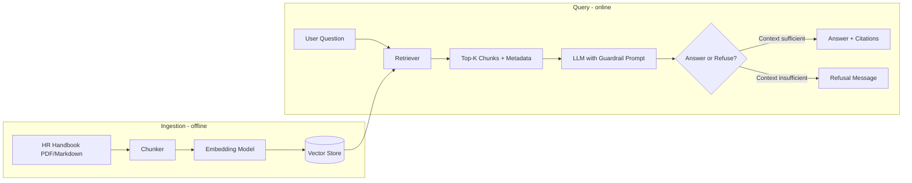

# Spec: Guardrailed Knowledge RAG (Option 2)

**Branch:** `prototype/guardrailed-knowledge-rag`  
**Status:** MVP implemented  
**Related:** [plan.md](./plan.md) (Section 4, Option 2)

---

## 1. Purpose

Build the smallest useful version of a **document-centric HR policy Q&A system** that:

1. Answers questions **only** from ingested HR policy documents.
2. **Refuses** to answer when the retrieved context does not support a verified response.
3. **Cites** the source document and section for every answer it gives.

This approach fits when policy questions are mostly **static** (handbook text), source documents already exist (PDFs/Markdown), and wrong answers carry **compliance risk** but personalized HRIS data (e.g., individual PTO balances) is not required.

---

## 2. Non-Goals (MVP)

| Out of scope | Reason |
| :--- | :--- |
| Personalized employee data | Requires HRIS integration (see Option 1 on `prototype/intent-driven-agentic-router`) |
| Multi-turn conversation memory | Single-turn Q&A is sufficient for policy lookups |
| Custom web UI | CLI/API first; chat integration is a follow-up |
| Production auth / SSO | Mock or local-only for MVP |
| Automated policy write-back | Read-only Q&A only |

---

## 3. Architecture



### Components

| Component | Responsibility | MVP choice |
| :--- | :--- | :--- |
| **Document loader** | Read PDF or Markdown policy files | `pypdf` or plain file read |
| **Chunker** | Split documents into overlapping segments | Fixed-size chunks (~500 tokens, 50-token overlap) |
| **Embedder** | Convert chunks to vectors | OpenAI `text-embedding-3-small` or local `sentence-transformers` |
| **Vector store** | Persist and search embeddings | ChromaDB (local, zero-infra) |
| **Retriever** | Fetch top-K relevant chunks for a query | Cosine similarity, K=3–5 |
| **Generator** | Produce answer from retrieved context | OpenAI GPT-4o-mini / Claude Haiku via API |
| **Guardrail layer** | Enforce cite-or-refuse behavior | System prompt + post-check for citation presence |

---

## 4. Guardrail Contract

Every generated response must follow one of two paths:

### Path A — Verified answer

- Content is **grounded exclusively** in retrieved chunks.
- Response includes **at least one citation**: document name + section/chunk ID.
- No extrapolation beyond what the text states.

### Path B — Refusal

When retrieved chunks do not contain enough information:

```
I cannot verify this from the current HR policy documents.
Please contact hr@company.com for assistance.
```

**Hard rules (system prompt):**

1. Do not use external knowledge or general HR assumptions.
2. Do not guess dates, dollar amounts, or eligibility rules.
3. Do not answer personalized questions (e.g., "my balance", "my enrollment status").
4. If multiple chunks conflict, refuse and direct to HR.

---

## 5. Data Model

### Source document metadata (per file)

```yaml
doc_id: handbook-2025-v3
title: Employee Handbook 2025
effective_date: 2025-01-01
source_path: data/policies/employee_handbook.pdf
owner: hr-team@company.com
```

### Chunk record (per segment)

```yaml
chunk_id: handbook-2025-v3#0042
doc_id: handbook-2025-v3
text: "Vacation accrual begins on your start date..."
section: "Time Off — Vacation Accrual"
char_start: 12400
char_end: 13100
embedding: [0.012, -0.034, ...]  # stored in vector DB
```

### Query response (API/CLI output)

```json
{
  "question": "When does vacation accrual start?",
  "status": "answered",
  "answer": "Vacation accrual begins on your start date at a rate of ...",
  "citations": [
    {
      "doc_id": "handbook-2025-v3",
      "section": "Time Off — Vacation Accrual",
      "chunk_id": "handbook-2025-v3#0042"
    }
  ],
  "retrieval_score": 0.87
}
```

Refusal response:

```json
{
  "question": "Can I bring my dog to the office?",
  "status": "refused",
  "answer": "I cannot verify this from the current HR policy documents. Please contact hr@company.com for assistance.",
  "citations": [],
  "retrieval_score": 0.31
}
```

---

## 6. Planned Repository Layout

```
censor-app/
├── plan.md                  # Full proposal (all 3 options)
├── spec.md                  # This file — RAG technical spec
├── README.md                # Project overview and usage
├── data/
│   ├── *.pdf                  # HR policy PDFs
│   └── chroma/                # Vector store (generated)
├── src/
│   ├── ingest.py            # Load → chunk → embed → store
│   ├── query.py             # Retrieve → generate → guardrail check
│   └── prompts.py           # System prompt templates
├── tests/
│   └── golden_qa.json       # Eval set for accuracy/refusal behavior
├── pyproject.toml
└── .env.example               # API keys (never commit .env)
```

---

## 7. CLI Interface (MVP)

### Ingest

```bash
python -m uv venv .venv --python 3.12
python -m uv pip install -e . --python .venv\Scripts\python.exe
```

```bash
python -m src.ingest --source data
```

Expected output: chunk count, embedding count, vector store path.

### Query

```bash
python -m src.query "When is the benefits enrollment deadline?" --pretty
```

Expected output: JSON with `status`, `answer`, `citations`.

---

## 8. Acceptance Criteria

| # | Criterion | Pass condition |
| :--- | :--- | :--- |
| 1 | **Grounded answers** | 100% of `answered` responses include ≥1 citation from retrieved chunks |
| 2 | **Refusal on gaps** | Questions outside handbook content return `status: refused` — no fabricated policy |
| 3 | **No personalization** | "How many PTO days do I have?" always refuses (not in static docs) |
| 4 | **Re-ingestion** | Re-running ingest on updated doc replaces stale chunks |
| 5 | **Latency** | p95 query response < 3 seconds (excluding cold start) |
| 6 | **Golden set** | ≥ 90% pass rate on `tests/golden_qa.json` before demo |

---

## 9. Golden Q&A Eval Set (starter)

| Question | Expected behavior |
| :--- | :--- |
| "When does vacation accrual start?" | Answer with citation from Time Off section |
| "What is the expense reimbursement limit for meals?" | Answer or refuse depending on handbook content |
| "When is open enrollment?" | Answer with citation if deadline is in docs |
| "How many vacation days do I have left?" | **Refuse** — personalized, not in static docs |
| "Can I work remotely from another country?" | Answer or refuse based on remote work policy section |
| "What is the pet insurance deductible?" | **Refuse** if not explicitly in docs |

---

## 10. Risks & Mitigations

| Risk | Impact | Mitigation |
| :--- | :--- | :--- |
| Stale chunks after policy update | Wrong answers | Version metadata on docs; re-ingest on upload |
| Retrieval misses correct passage | Refusal or incomplete answer | Tune chunk size/overlap; hybrid keyword + vector search (v2) |
| LLM paraphrases incorrectly | Compliance liability | Cite-or-refuse prompt; post-check citation exists; golden eval set |
| Low adoption | HR still overloaded | Deploy in Slack/Teams after MVP validates accuracy (v2) |
| Maintenance burden | Eng team owns pipeline | HR owns source PDFs; ingest is one command |

---

## 11. Success Metrics

Aligned with [plan.md](./plan.md) Section 6:

| Metric | MVP target | Measurement |
| :--- | :--- | :--- |
| Citation rate | 100% of answered queries | Automated check on response JSON |
| Refusal accuracy | 100% on out-of-scope golden questions | `tests/golden_qa.json` |
| Retrieval precision | ≥ 80% relevant chunk in top-3 | Manual review on 20-question sample |
| Deflection rate | Baseline only at MVP | Track after Slack/Teams integration |

---

## 12. Implementation Phases

| Phase | Deliverable | Est. effort |
| :--- | :--- | :--- |
| **Phase 0** | `spec.md`, `README.md`, sample handbook | Done |
| **Phase 1** | Ingest pipeline + ChromaDB store | Done |
| **Phase 2** | Query pipeline + guardrail prompt | Done |
| **Phase 3** | Golden eval set + refusal tests | Done |
| **Phase 4** | FastAPI wrapper (optional) | Not started |

---

## 13. Environment Variables

```env
# .env.example
OPENAI_API_KEY=sk-...
GROQ_API_KEY=gsk_...           # fallback LLM if OpenAI fails

EMBEDDING_MODEL=text-embedding-3-small
OPENAI_LLM_MODEL=gpt-4o-mini
GROQ_LLM_MODEL=llama-3.3-70b-versatile

VECTOR_STORE_PATH=./data/chroma
DATA_DIR=./data
TOP_K=5
REFUSAL_THRESHOLD=0.40         # min retrieval score to attempt answer
HR_CONTACT_EMAIL=hr@company.com
```
