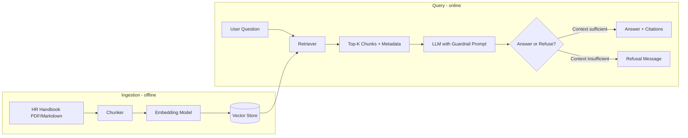

# Spec: Guardrailed Knowledge RAG (Option 2)

**Branch:** `prototype/guardrailed-knowledge-rag`  
**Status:** MVP implemented  
**Related:** [plan.md](./plan.md) (Section 4, Option 2) · [README.md](./README.md) (usage guide)

---

## Document Index

| Section | Topic |
| :--- | :--- |
| [§1](#1-purpose) | Purpose and fit criteria |
| [§2](#2-non-goals-mvp) | Non-goals |
| [§3](#3-architecture) | Architecture and components |
| [§4](#4-guardrail-contract) | Cite-or-refuse contract |
| [§5](#5-data-model) | Data model and JSON schemas |
| [§6](#6-repository-layout) | Repository layout |
| [§7](#7-cli-interface) | CLI commands |
| [§8](#8-module-reference) | Python module reference |
| [§9](#9-acceptance-criteria) | Acceptance criteria |
| [§10](#10-golden-qa-eval-set) | Golden Q&A eval set |
| [§11](#11-risks--mitigations) | Risks and mitigations |
| [§12](#12-success-metrics) | Success metrics |
| [§13](#13-implementation-phases) | Implementation phases |
| [§14](#14-vector-store-decision) | Vector store decision (ChromaDB vs pgvector) |
| [§15](#15-environment-variables) | Environment variables |
| [§16](#16-key-engineering-decisions) | Key engineering decisions (detailed) |
| [§17](#17-future-work) | Future work and production gates |

---

## 1. Purpose

Build the smallest useful version of a **document-centric HR policy Q&A system** that:

1. Answers questions **only** from ingested HR policy documents.
2. **Refuses** to answer when the retrieved context does not support a verified response.
3. **Cites** the source document and section for every answer it gives.

This approach fits when policy questions are mostly **static** (handbook text), source documents already exist (PDFs/Markdown), and wrong answers carry **compliance risk** but personalized HRIS data (e.g., individual PTO balances) is not required.

---

## 2. Non-Goals (MVP)

| Out of scope | Reason |
| :--- | :--- |
| Personalized employee data | Requires HRIS integration (see Option 1 on `prototype/intent-driven-agentic-router`) |
| Multi-turn conversation memory | Single-turn Q&A is sufficient for policy lookups |
| Streamlit web UI | **Implemented** — input-at-top layout; not a production portal |
| Slack/Teams bot | Web UI proves pipeline; chat-platform deploy is follow-up |
| Production auth / SSO | Mock or local-only for MVP |
| Automated policy write-back | Read-only Q&A only |

---

## 3. Architecture



### Components

| Component | Responsibility | MVP choice |
| :--- | :--- | :--- |
| **Document loader** | Read PDF or Markdown policy files | `pypdf` or plain file read |
| **Chunker** | Split documents into overlapping segments | Fixed-size chunks (~500 tokens, 50-token overlap) |
| **Embedder** | Convert chunks to vectors | OpenAI `text-embedding-3-small` or local `sentence-transformers` |
| **Vector store** | Persist and search embeddings | ChromaDB (local, zero-infra) |
| **Retriever** | Fetch top-K relevant chunks for a query | Cosine similarity, K=3–5 |
| **Generator** | Produce answer from retrieved context | OpenAI GPT-4o-mini primary; Groq Llama 3.3 fallback |
| **Guardrail layer** | Enforce cite-or-refuse behavior | 3-layer: pre-filter → retrieval gate → LLM prompt |

---

## 4. Guardrail Contract

Every generated response must follow one of two paths:

### Path A — Verified answer

- Content is **grounded exclusively** in retrieved chunks.
- Response includes **at least one citation**: document name + section/chunk ID.
- No extrapolation beyond what the text states.

### Path B — Refusal

When retrieved chunks do not contain enough information:

```
I cannot verify this from the current HR policy documents.
Please contact hr@company.com for assistance.
```

**Hard rules (system prompt):**

1. Do not use external knowledge or general HR assumptions.
2. Do not guess dates, dollar amounts, or eligibility rules.
3. Do not answer personalized questions (e.g., "my balance", "my enrollment status").
4. If multiple chunks conflict, refuse and direct to HR.

---

## 5. Data Model

### Source document metadata (per file)

```yaml
doc_id: handbook-2025-v3
title: Employee Handbook 2025
effective_date: 2025-01-01
source_path: data/policies/employee_handbook.pdf
owner: hr-team@company.com
```

### Chunk record (per segment)

```yaml
chunk_id: handbook-2025-v3#0042
doc_id: handbook-2025-v3
text: "Vacation accrual begins on your start date..."
section: "Time Off — Vacation Accrual"
char_start: 12400
char_end: 13100
embedding: [0.012, -0.034, ...]  # stored in vector DB
```

### Query response (API/CLI output)

```json
{
  "question": "When does vacation accrual start?",
  "status": "answered",
  "answer": "Vacation accrual begins on your start date at a rate of ...",
  "citations": [
    {
      "doc_id": "handbook-2025-v3",
      "section": "Time Off — Vacation Accrual",
      "chunk_id": "handbook-2025-v3#0042"
    }
  ],
  "retrieval_score": 0.87
}
```

Refusal response:

```json
{
  "question": "Can I bring my dog to the office?",
  "status": "refused",
  "answer": "I cannot verify this from the current HR policy documents. Please contact hr@company.com for assistance.",
  "citations": [],
  "retrieval_score": 0.31
}
```

---

## 6. Planned Repository Layout

```
censor-app/
├── plan.md                  # Full proposal (all 3 options)
├── spec.md                  # This file — RAG technical spec
├── README.md                # Project overview and usage
├── data/
│   ├── *.pdf                  # HR policy PDFs
│   └── chroma/                # Vector store (generated)
├── src/
│   ├── config.py            # Environment settings
│   ├── documents.py         # PDF page extraction
│   ├── chunker.py           # Token-based chunking
│   ├── embeddings.py        # OpenAI embedding client
│   ├── store.py             # ChromaDB vector store
│   ├── llm.py               # OpenAI → Groq fallback
│   ├── prompts.py           # Guardrail prompt templates
│   ├── ingest.py            # Offline ingestion CLI
│   ├── query.py             # Online query CLI
│   ├── ui.py                # Streamlit web UI
│   └── eval.py              # Golden Q&A evaluation
├── tests/
│   └── golden_qa.json       # Eval set for accuracy/refusal behavior
├── pyproject.toml
└── .env.example               # API keys (never commit .env)
```

---

## 7. CLI Interface (MVP)

### Ingest

```bash
python -m uv venv .venv --python 3.12
python -m uv pip install -e . --python .venv\Scripts\python.exe
```

```bash
python -m src.ingest --source data
```

Expected output: chunk count, embedding count, vector store path.

### Query

```bash
python -m src.query "When is the benefits enrollment deadline?" --pretty
```

Expected output: JSON with `status`, `answer`, `citations`.

### Web UI

```bash
streamlit run src/ui.py
# or: hr-ui
```

Opens at http://localhost:8501 — chat interface with citations and refusal display.

### Evaluate

```bash
python -m src.eval
python -m src.eval --file tests/golden_qa.json
```

---

## 8. Module Reference

| Module | Entry point | Description |
| :--- | :--- | :--- |
| `config.py` | `settings` | Loads `.env` into an immutable `Settings` dataclass |
| `documents.py` | `load_documents()` | Extracts per-page text from PDF files |
| `chunker.py` | `chunk_pages()` | Splits pages into overlapping token chunks |
| `embeddings.py` | `EmbeddingClient` | OpenAI embedding API wrapper |
| `store.py` | `VectorStore` | ChromaDB persistent store with cosine similarity |
| `llm.py` | `LLMClient.complete()` | Chat completion with OpenAI → Groq fallback |
| `prompts.py` | `build_system_prompt()` | Guardrail prompt templates |
| `ingest.py` | `python -m src.ingest` | Offline pipeline CLI |
| `query.py` | `answer_question()` | Online pipeline with 3-layer guardrails |
| `ui.py` | `streamlit run src/ui.py` | Streamlit chat web interface |
| `eval.py` | `python -m src.eval` | Golden Q&A regression runner |

### Query pipeline stages

```
question
  │
  ├─[Layer 1] is_personalized_question? ──yes──► refused (reason: personalized_question)
  │
  ├─ embed question (OpenAI)
  ├─ retrieve top-K chunks (ChromaDB)
  │
  ├─[Layer 2] best_score < REFUSAL_THRESHOLD? ──yes──► refused (reason: low_retrieval_score)
  │
  ├─ LLM generation (OpenAI → Groq fallback)
  │
  └─[Layer 3] is_refusal(answer)? ──yes──► refused (reason: model_refusal)
              └──no──► answered + citations
```

---

## 9. Acceptance Criteria

| # | Criterion | Pass condition |
| :--- | :--- | :--- |
| 1 | **Grounded answers** | 100% of `answered` responses include ≥1 citation from retrieved chunks |
| 2 | **Refusal on gaps** | Questions outside handbook content return `status: refused` — no fabricated policy |
| 3 | **No personalization** | "How many PTO days do I have?" always refuses (not in static docs) |
| 4 | **Re-ingestion** | Re-running ingest on updated doc replaces stale chunks |
| 5 | **Latency** | p95 query response < 3 seconds (excluding cold start) |
| 6 | **Golden set** | ≥ 90% pass rate on `tests/golden_qa.json` before demo |

---

## 10. Golden Q&A Eval Set (starter)

| Question | Expected behavior |
| :--- | :--- |
| "When does vacation accrual start?" | Answer with citation from Time Off section |
| "What is the expense reimbursement limit for meals?" | Answer or refuse depending on handbook content |
| "When is open enrollment?" | Answer with citation if deadline is in docs |
| "How many vacation days do I have left?" | **Refuse** — personalized, not in static docs |
| "Can I work remotely from another country?" | Answer or refuse based on remote work policy section |
| "What is the pet insurance deductible?" | **Refuse** if not explicitly in docs |

---

## 11. Risks & Mitigations

| Risk | Impact | Mitigation |
| :--- | :--- | :--- |
| Stale chunks after policy update | Wrong answers | Version metadata on docs; re-ingest on upload |
| Retrieval misses correct passage | Refusal or incomplete answer | Tune chunk size/overlap; hybrid keyword + vector search (v2) |
| LLM paraphrases incorrectly | Compliance liability | Cite-or-refuse prompt; post-check citation exists; golden eval set |
| Low adoption | HR still overloaded | Deploy in Slack/Teams after MVP validates accuracy (v2) |
| Maintenance burden | Eng team owns pipeline | HR owns source PDFs; ingest is one command |

---

## 12. Success Metrics

Aligned with [plan.md](./plan.md) Section 6:

| Metric | MVP target | Measurement |
| :--- | :--- | :--- |
| Citation rate | 100% of answered queries | Automated check on response JSON |
| Refusal accuracy | 100% on out-of-scope golden questions | `tests/golden_qa.json` |
| Retrieval precision | ≥ 80% relevant chunk in top-3 | Manual review on 20-question sample |
| Deflection rate | Baseline only at MVP | Track after Slack/Teams integration |

---

## 13. Implementation Phases

| Phase | Deliverable | Est. effort |
| :--- | :--- | :--- |
| **Phase 0** | `spec.md`, `README.md`, sample handbook | Done |
| **Phase 1** | Ingest pipeline + ChromaDB store | Done |
| **Phase 2** | Query pipeline + guardrail prompt | Done |
| **Phase 3** | Golden eval set + refusal tests | Done |
| **Phase 4** | Streamlit web UI | Done |
| **Phase 5** | FastAPI wrapper (optional) | Not started |

---

## 14. Vector Store Decision

### Why ChromaDB for the MVP

| Criterion | ChromaDB | pgvector | Managed (Pinecone) |
| :--- | :--- | :--- | :--- |
| Setup time | Minutes (pip install) | Hours (Postgres + extension) | Hours (account + config) |
| Infrastructure | Local files only | Requires PostgreSQL | Cloud vendor |
| Fit for 187 chunks | Excellent | Over-engineered | Over-engineered |
| Production audit trail | Limited | Strong (SQL joins) | Vendor-dependent |
| Migration effort | N/A | Medium (swap `store.py`) | Medium |

**Decision:** ChromaDB for MVP speed and zero ops. The store interface in `src/store.py` is the only module that needs changing to migrate to pgvector when PostgreSQL is already in the client's stack.

### When to migrate

- Client already runs PostgreSQL in production
- Need SQL joins between policy metadata, audit logs, and vectors
- Corpus grows beyond ~100k chunks requiring distributed search

---

## 15. Environment Variables

See [.env.example](./.env.example) for the annotated template.

| Variable | Required | Default | Description |
| :--- | :--- | :--- | :--- |
| `OPENAI_API_KEY` | Yes | — | Embeddings and primary LLM |
| `GROQ_API_KEY` | Recommended | — | Fallback LLM on OpenAI failure |
| `EMBEDDING_MODEL` | No | `text-embedding-3-small` | OpenAI embedding model |
| `OPENAI_LLM_MODEL` | No | `gpt-4o-mini` | Primary chat model |
| `GROQ_LLM_MODEL` | No | `llama-3.3-70b-versatile` | Fallback chat model |
| `VECTOR_STORE_PATH` | No | `./data/chroma` | ChromaDB persistence directory |
| `DATA_DIR` | No | `./data` | Default PDF source directory |
| `TOP_K` | No | `5` | Chunks retrieved per query |
| `REFUSAL_THRESHOLD` | No | `0.40` | Min cosine similarity to attempt answer |
| `CHUNK_SIZE` | No | `500` | Tokens per chunk |
| `CHUNK_OVERLAP` | No | `50` | Token overlap between chunks |
| `HR_CONTACT_EMAIL` | No | `hr@company.com` | Contact in refusal messages |

---

## 16. Key Engineering Decisions

Each decision below maps a **problem** → **options considered** → **choice made** → **tradeoff accepted**.

### 16.1 Approach selection: why Option 2?

| Problem | Options | Decision | Rationale |
| :--- | :--- | :--- | :--- |
| Vague "automate HR Q&A" request | Option 1 (router), Option 2 (RAG), Option 3 (managed) | **Option 2** | 3 PDF handbooks available; questions are static policy text; no HRIS API access required for MVP |
| Wrong answer risk | Generic chatbot, RAG, human-only | **Guardrailed RAG** | Cite-or-refuse reduces compliance liability vs. open-ended generation |

**When to revisit:** If discovery reveals >30% personalized queries → add Option 1. If Slack-first + no eng team → evaluate Option 3.

### 16.2 Guardrail architecture

| Problem | Options | Decision | Rationale |
| :--- | :--- | :--- | :--- |
| LLM hallucination on policy | Prompt-only, RAG-only, layered guards | **3 layers** | Prompt alone failed golden eval; retrieval gate saves cost and blocks weak matches |
| Personalized questions | Send to LLM, refuse, route to HRIS | **Refuse at Layer 1** | Static PDFs cannot contain individual balances |

### 16.3 Retrieval and chunking

| Parameter | Value | Why not alternatives? |
| :--- | :--- | :--- |
| `CHUNK_SIZE=500` | 500 tokens | 256 loses context; 1000 reduces retrieval precision |
| `CHUNK_OVERLAP=50` | 50 tokens | Zero overlap splits policy sentences across chunks |
| `TOP_K=5` | 5 chunks | 3 missed relevant passages; 10 adds noise to LLM context |
| `REFUSAL_THRESHOLD=0.40` | 0.40 cosine similarity | 0.45 refused too many valid questions; 0.35 risked weak matches |

### 16.4 Infrastructure choices

| Component | Choice | Rejected alternative | Why |
| :--- | :--- | :--- | :--- |
| Vector store | ChromaDB (local) | pgvector | Zero infra for 187-chunk prototype; pgvector for production |
| Embeddings | OpenAI `text-embedding-3-small` | Local `sentence-transformers` | Better quality; local model adds dependency weight |
| LLM | OpenAI → Groq fallback | Single provider | Demo resilience when OpenAI rate-limits or fails |
| Runtime | uv + Python 3.12 | pip + 3.11 | Reproducible env; 3.12 for modern typing |

### 16.5 UI design

| Problem | Options | Decision | Rationale |
| :--- | :--- | :--- | :--- |
| HR demo needs visual interface | CLI only, Streamlit, React | **Streamlit** | Same `answer_question()` pipeline; ~200 lines; no frontend build step |
| Input disappears on rerun | Bottom `st.chat_input`, top form | **Top `st.form`** | Streamlit requires consistent widget calls; bottom chat input broke after example clicks |
| Example questions | Sidebar only, main area | **Main area under input** | Keeps input + examples together above history |

### 16.6 Build vs. buy (Option 2 specifically)

| Criterion | Custom build (this repo) | Managed bot (Option 3) |
| :--- | :--- | :--- |
| Refusal behavior control | Full — 3 layers in code | Vendor-dependent |
| Data residency | Local ChromaDB + API calls only | Vendor cloud |
| Time to first demo | 2–4 weeks | 1–2 weeks |
| Long-term maintenance | Eng owns pipeline | Vendor manages infra |

**Decision:** Custom build for prototype evaluation. Re-evaluate Option 3 if client is M365-native with limited engineering bandwidth.

---

## 17. Future Work

### 17.1 Near-term (before HR demo)

- [ ] Expand `tests/golden_qa.json` from real anonymized HR question logs
- [ ] Reach ≥90% golden eval pass rate (currently 75% — 6/8)
- [ ] Add document effective-date metadata to chunks for stale-policy detection
- [ ] Document ingestion runbook for HR (when to re-run `src.ingest`)

### 17.2 Medium-term (post-validation)

| Item | Purpose | Blocked by |
| :--- | :--- | :--- |
| Slack/Teams bot | Adoption where employees already ask questions | Discovery Q1 |
| Option 1 intent router (`prototype/intent-driven-agentic-router`) | Personalized HRIS queries | Workday/ADP API access |
| pgvector migration | Production audit trail + SQL joins | Client PostgreSQL availability |
| Hybrid retrieval (vector + BM25) | Fix retrieval misses on exact policy terms | Retrieval error analysis |
| FastAPI REST layer | Non-Streamlit integrations | API consumer identified |

### 17.3 Production decision gates

Do **not** productionize until all gates pass:

1. **Accuracy** — Golden Q&A ≥ 90%; HR human audit of 20 answers with zero fabricated policy.
2. **Refusal safety** — 100% refusal on personalized and out-of-scope questions in eval set.
3. **Operational** — HR owns doc updates; re-ingestion process documented and tested.
4. **Channel** — Deployment surface chosen (web, Slack, or both) from discovery Q1.
5. **Personalization** — If >30% queries need HRIS data, Option 1 router deployed alongside Option 2.

### 17.4 Known MVP limitations (accepted)

- Golden eval at 75%, not 90% target — tuning needed per handbook
- Multiple PDFs may return conflicting policy text — no conflict-resolution layer yet
- PDF text extraction quality varies — scanned PDFs may produce poor chunks
- No query logging or analytics — deflection rate cannot be measured yet
- Streamlit is demo-only — not suitable for enterprise SSO or multi-tenant deployment
